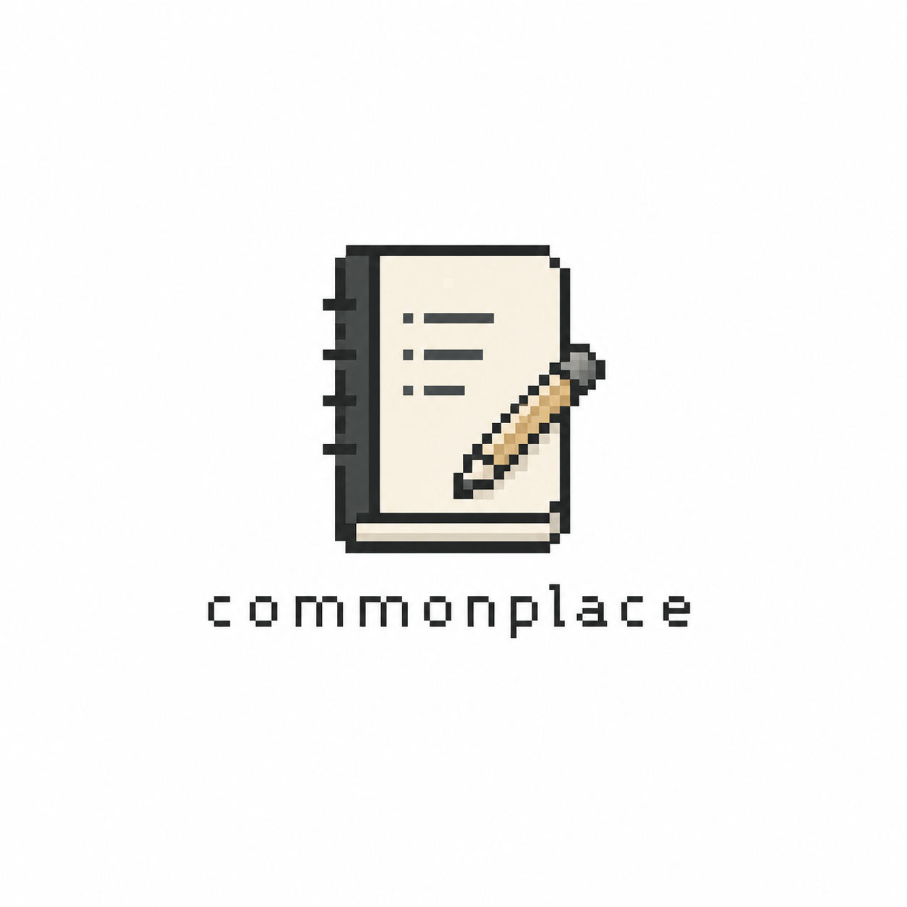

<div align="center">
  

  # Commonplace

  **A local-first desktop student assistant for notes, PDFs, ideas, topic graphs, and universal search.**

  <p>
    
    
    
    
  </p>

  <p>
    <a href="https://github.com/grubs-bit/CommonPlace/releases/tag/v0.1.0"><strong>Download v0.1.0</strong></a>
    ·
    <a href="#getting-started">Run from source</a>
    ·
    <a href="#roadmap">Roadmap</a>
  </p>
</div>

---

Commonplace is a desktop student assistant designed for keeping university material tidy without turning your study life into a corporate SaaS dashboard. It gives you one place for **markdown notes**, **PDFs/imports**, **developing ideas**, **topic maps**, and **search across everything**.

It is intentionally restrained: no accounts, no AI layer, no forced cloud. You choose where your library lives.

## Download

Prebuilt desktop builds are available on the GitHub release page:

```text
https://github.com/grubs-bit/CommonPlace/releases/tag/v0.1.0
```

| Platform | Asset | Notes |
|---|---|---|
| macOS Apple Silicon | `Commonplace-0.1.0-arm64.dmg` | Unsigned; right-click → Open if Gatekeeper warns. |
| macOS Apple Silicon | `Commonplace-0.1.0-arm64-mac.zip` | Zipped `.app` alternative. |
| Windows x64 | `Commonplace.Setup.0.1.0.exe` | Installer; unsigned, so SmartScreen may warn. |
| Windows x64 | `Commonplace.0.1.0.exe` | Portable executable; unsigned. |

> Current builds are unsigned. That is expected until code-signing certificates / Apple Developer ID are added.

## Highlights

- **Academic dashboard** — recent notes, ideas, and files in one clean workspace.
- **Markdown notes** — write structured study notes with a live preview.
- **Idea bank** — collect raw ideas, expand them with markdown, and mark them as `Raw`, `Developing`, `Useful`, or `Archived`.
- **Library imports** — add PDFs, markdown files, and text notes.
- **Universal search** — search notes, ideas, imported file metadata, tags, modules, topics, and extracted text.
- **3D topic graph** — assign `#topics` to notes, ideas, and files, then explore them as connected bubbles.
- **Local-first storage** — your data lives in a folder you choose on first launch.
- **Cloud optional** — choose an iCloud, OneDrive, Dropbox, or Google Drive folder and Commonplace will use that provider’s desktop sync.
- **Dark mode + sharper UI** — a cleaner, less generic workspace with tighter edges and a dedicated appearance toggle.
- **No AI** — this app does not summarise, train on, or send your notes anywhere.

## Screens / Sections

```text
Commonplace
├── Dashboard     Recent material and quick overview
├── Library       PDFs, markdown files, text imports
├── Notes         Markdown editor and preview
├── Ideas         Expandable idea bank for essays, projects, research
├── Topic Graph   3D bubble map connecting shared #topics
└── Settings      Appearance, library location, cloud sync detection
```

## Storage Model

On first launch, Commonplace asks the user to choose a library location. Inside that chosen location it creates:

```text
Commonplace Library/
├── commonplace-data.json
├── files/
│   ├── pdfs/
│   └── imports/
└── backups/
```

The app source code is separate from user data. Users can place their library anywhere, including a synced cloud folder. Cloud sync is intentionally provider-based: choose an iCloud/OneDrive/Google Drive/Dropbox folder and let that provider sync the files.

## Current Status

This is an early working `v0.1.0` build. Core functionality exists:

- app shell and sharper academic dashboard
- custom Commonplace app icon
- light/dark appearance toggle
- first-launch library folder picker
- markdown notes with preview
- ideas with statuses and markdown detail
- PDF/text/markdown imports
- `#topic` assignment for notes, ideas, and files
- 3D topic graph with bubble and line connections
- universal search
- cloud provider detection/integration via synced folders
- unsigned macOS Apple Silicon release artifacts
- unsigned Windows x64 release artifacts

## Tech Stack

- **Electron** for cross-platform desktop packaging
- **React** for the interface
- **Vite** for development/build tooling
- **Vitest** for tests
- **react-markdown** for markdown preview
- **pdf-parse** for basic PDF text extraction

## Getting Started

Clone the repository:

```bash
git clone https://github.com/grubs-bit/CommonPlace.git
cd CommonPlace
```

Install dependencies:

```bash
npm install
```

Run the desktop app in development mode:

```bash
npm run dev
```

Run tests:

```bash
npm test
```

Build the frontend:

```bash
npm run build
```

## Packaging

### macOS

The macOS build is currently configured to remain **unsigned**:

```bash
npm run package:mac
```

Outputs are created under:

```text
release/
├── Commonplace-0.1.0-arm64.dmg
├── Commonplace-0.1.0-arm64-mac.zip
└── mac-arm64/Commonplace.app
```

Because the app is unsigned, macOS may show a Gatekeeper warning. Open it with right-click → **Open**, or approve it from System Settings.

### Windows

Windows packaging is configured with Electron Builder:

```bash
npm run package:win
```

Outputs include:

```text
release/
├── Commonplace Setup 0.1.0.exe
├── Commonplace 0.1.0.exe
└── win-unpacked/Commonplace.exe
```

For the most reliable Windows installer, build on a Windows machine or use GitHub Actions. Windows builds produced from macOS should still be tested on Windows before broad distribution.

## Roadmap

### Near term

- Improve in-app PDF viewing and page navigation.
- Add export for notes and ideas as `.md` files.
- Add manual backup and restore controls.
- Add a better empty-state/sample-library onboarding flow.
- Improve topic graph controls: zoom, pan, filtering, and topic search.

### Release/distribution

- Add GitHub Actions to build macOS and Windows artifacts automatically.
- Add Windows test pass on a real Windows runner/machine.
- Add universal macOS builds if Intel Mac support is needed.
- Add optional code signing/notarization later.
- Add release checksums for downloaded assets.

### Later ideas

- Optional portable-library mode.
- Better PDF text extraction status and retry controls.
- Import/export full libraries as archives.
- More keyboard shortcuts.
- Per-module/course organization views.

## Philosophy

Commonplace is for students who want a quiet, reliable place to think. It should feel closer to a study desk than an admin panel.

No feeds. No accounts. No AI mist. Just your notes, your files, your ideas, and a search bar that actually helps.
